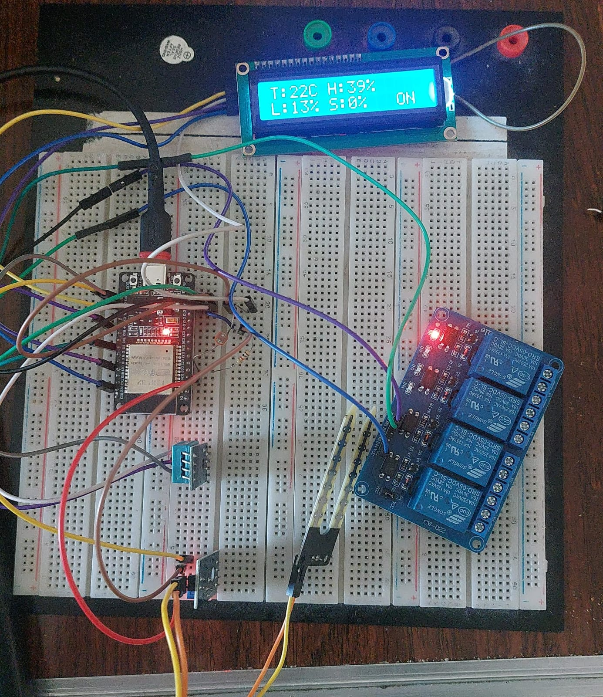

# 🌱 Smart Greenhouse - ESP32

A smart IoT greenhouse monitoring and control system using ESP32, Blynk, Firebase, and AI-based pump control.



---

## 📦 Features

- 🌡️ **Temperature & Humidity** monitoring via DHT11
- 💧 **Soil Moisture** sensing with automatic pump control
- ☀️ **Light intensity** monitoring via LDR
- 📲 **Remote control** via Blynk mobile app
- 🔥 **Firebase Realtime Database** logging
- 🤖 **AI-based pump decisions** read from Firebase `/AI_Decision/pump`
- 🖥️ **16x2 LCD display** (I2C)
- 🔁 **Auto / Manual** mode switching

---

## 🛠️ Hardware

| Component | Pin |
|---|---|
| DHT11 | GPIO 4 |
| LDR | GPIO 35 |
| Soil Moisture Sensor | GPIO 34 |
| Relay (Pump) | GPIO 5 |
| LCD (I2C) | SDA/SCL |

---

## 📚 Libraries Required

Install these from Arduino Library Manager:

- `Blynk` by Volodymyr Shymanskyy
- `DHT sensor library` by Adafruit
- `LiquidCrystal_I2C` by Frank de Brabander
- `Firebase ESP32 Client` by Mobizt

---

## ⚙️ Setup

### 1. Clone the repo
```bash
git clone https://github.com/YOUR_USERNAME/smart-greenhouse.git
cd smart-greenhouse
```

### 2. Create your config file
```bash
cp config.h.example config.h
```

### 3. Edit `config.h` with your real credentials
```cpp
#define BLYNK_TEMPLATE_ID   "TMPLxxxxxxxx"
#define BLYNK_AUTH_TOKEN    "your_blynk_token"
#define WIFI_SSID           "YourWiFiName"
#define WIFI_PASS           "YourWiFiPassword"
#define FIREBASE_HOST       "your-project-default-rtdb.firebaseio.com"
```

### 4. Upload to ESP32 via Arduino IDE

---

## 📱 Blynk Virtual Pins

| Pin | Function |
|---|---|
| V0 | Soil Moisture % |
| V1 | Temperature °C |
| V2 | Humidity % |
| V3 | Light % |
| V4 | Pump Control (manual) |
| V5 | Mode Switch (Auto/Manual) |

---

## 🔥 Firebase Structure

```
/SensorLogs/
  ├── Temperature
  ├── Humidity
  ├── Light
  ├── Soil_Moisture
  ├── Pump_State
  └── Mode

/AI_Decision/
  └── pump   ← (0 or 1) set by your AI model
```

---

## 🔒 Security Note

**Never commit `config.h`** — it contains your credentials.
The `.gitignore` file already excludes it.

---

## 📸 System Preview

The LCD shows:
```
T:22C H:39%
S:0%  L:13% A
```
Where `A` = Auto mode, `M` = Manual mode.

---


